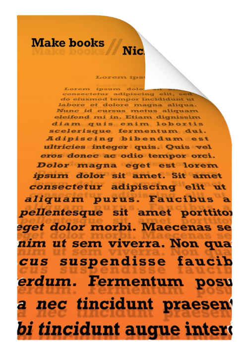

# Make-books

## Write a beautiful book

I like to write books and I like to make books. Both literarily. They have a lot in common and even more _not_ in common. Writing is a creative process. Words, words and words. On the other hand, _making_ books is mostly a technical process.

It’s a nice combination.

For years and years I’m searching for the “perfect” book environment. Perfect for writing, perfect for self publishing. It’s been a long journey, I made my first books around 2004. Half the time was writing; the other half programming. At that time, I was much into web programming so my “publishing system” was home-made in PHP and MySQL. Fun to do, impossible to maintain.

So, time to make a new system! Instead of reinventing the wheel I looked around, learned [LaTeX](https://www.latex-project.org), found [Pandoc](https://pandoc.org), learned a bit of shell and [Lua](https://www.lua.org) scripting and glued that whole stuff together to my brand new writing environment.

I’m not a writer, nor a programmer, just a hobbyist who does this for fun. It was a lot (lot, lot, lot) try-and-error and I’m sure many parts could be done better but that does not matter for me. That’s part of the fun, just keep learning!

It’s all here, a repo with all the bits and pieces to make beautiful PDF’s and ePub books. An sample book, which is actually the manual, is included and it explains it all...

It’s my small contribution to the Open Source World who gave me all this great stuff to play with!
