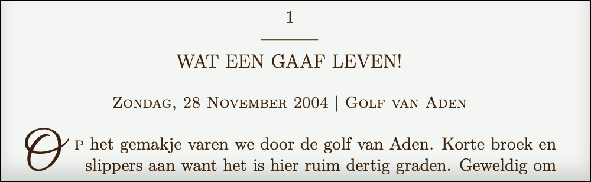
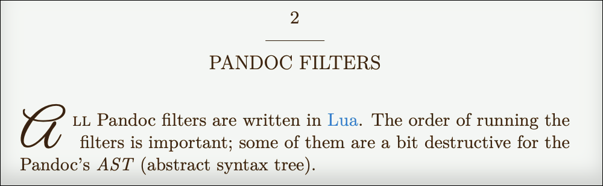

# Markup your words

#image

The books have to be written in *markdown*. Cut and paste from  [Wikipedia](https://en.wikipedia.org/wiki/Markdown): “Markdown is a lightweight markup language with plain-text-formatting syntax. Its design allows it to be converted into many output formats.”

There are many flavours of Markdown and since I use *Pandoc* for the book creation it’s obvious I use Pandocs flavour. See [their manual](https://pandoc.org/MANUAL.html#pandocs-markdown) for the details. However, there are some “rules” to follow, specifically for this book building system:

## Headers

- Chapters are marked with `#`.
- Sections within chapters are marked with `##`.
- Subsections within sections are marked with `###`.

And that’s it! There are no more headers available. This for a good reason. When creating an ePub; the headers are shifted according their place in the book. A book can be divided into `books` (when making collections) and `parts`. So, if a chapter is inside a *part*; the header will be shifted. If the *part* is part (haha) of a *book* it is shifted one more time. So, that is why `####` and `#####` are not available. The `######` is special, see later on...

## Paragraphs

In good *Markdown style*, “enters” in the source files are more or less ignored. One enter does nothing; two enters are just starting the text on a new line. By design, there is no space between paragraphs. You can enter as much as you like, but you will never even get *some* space between paragraphs this way. They are simply ignored.

---

To get some space between the paragraphs, as you can see here, this system is “misusing” the `horizontal rule` tag. In Markdown, that’s “`---`” or variations on that. See the Pandoc documentation.

---

So, the `horizontal rule` is not available for its normal intended use. Too bad, but I think this is the “cleanest” hack I could think of.

## Chapter’s Précis

Markup `######` has a special function. A line with this markup will be converted to a *‌Chapter's Précis*. Thats a line below the chapter name. Call it a *sub-chapter-name* or something, it’s a ‘subparagraph’ in LaTeX language. I use it to write the date and place underneath a story for example:

{width=85%}

## Images

Images are done in “normal” Markdown; except you can set the width for an image as well. This is not something I invented; it’s part of Pandocs flavour of Markdown.

	{width=85%}

{width=85%}

The `caption` is not required; nor the `width`. If no width is specified; it will default to 92% because I think that looks nice with the indentation of the paragraphs. Assuming the image is larger than the page itself...

## All the rest

Well, just “normal” Markdown. Plain (haha) and simple.

### Inline styling:

	Lets write in *italic* or in **bold**...

Lets write in *italic* or in **bold**...

	I made a ~~mistake~~ stiketrough...

I made a ~~mistake~~ striketrough...

### Quotations:

	> "I’m a quote!"

> “I’m a quote!”

### Lists:

	- I’m a list item
	- And so am I!

- I’m a list item
- And so am I!

They can have numbers as well...

	1. I’m a numbered list item
	2. And so am I!

1. I’m a numbered list item
2. And so am I!

### Footnotes:

Footnotes can be in the paragraph itself `^[This is a footnote.]` However, the Pandoc way of putting footnotes in a book also allows for naming the footnote inline like so:

	Here is a footnote reference,[^1]

and the footnote itself can be at the end of the document like so:

	[^1]: Here is the footnote.

---

Last but not least: have an empty line between all the block elements; eg, headers, lists, images, quotes etcetera or else strange things can happen. Also, at all times, end your documents with an empty line. You’ve been warned!

