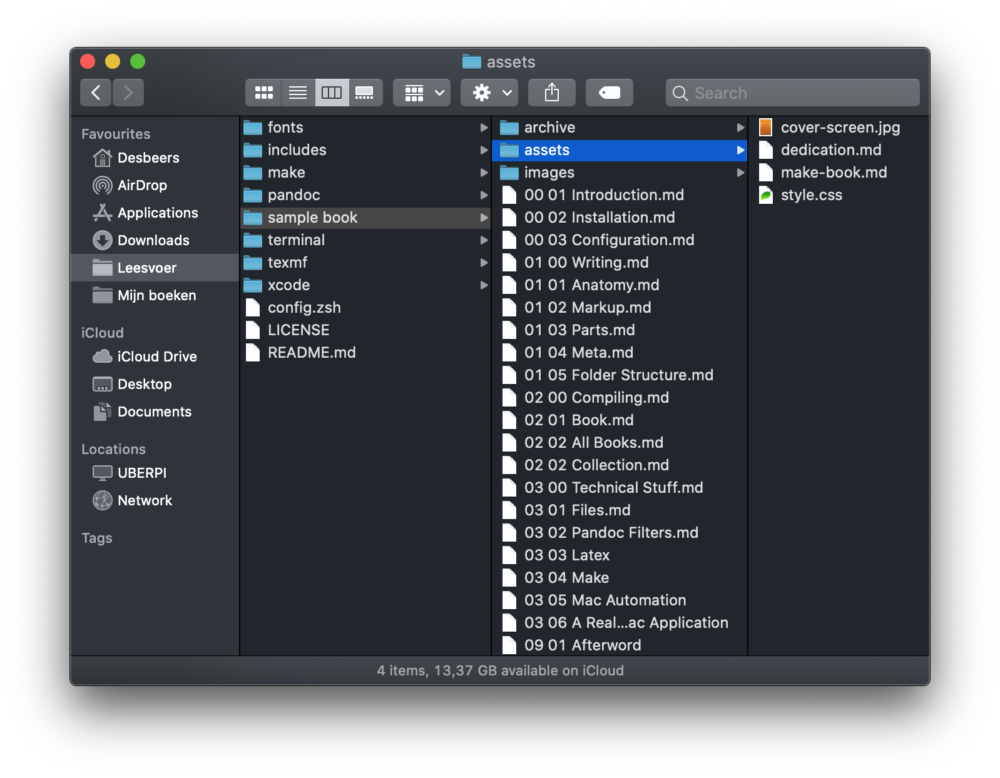

# The folder structure of your book

#image

There are some rules to follow to get everything nice and dandy. Your book must be organised in a specific way:

{width=85%}

All your *normal* text files should be in the root folder. That includes the `\frontmatter`, `\part` and `\backmatter` pages. The pages are processed in alphabetical order. As you can see above, I just numbered the files in `part-chapter-name` order. So, reordering pages is just a matter of renaming the files.

## The `assets` folder

There are a couple of files in this folder:

### dedication.md

> The *dedication* file for your book, as described before. It is not required; however, feel free to thank me...

### cover-screen.jpg

> If this file exists, it will be used as cover page when creating PDF’s and ePubs. It is not required.

### make-book.md

> The `make-book.md` file as described before.

### style.css

> If this file exists, it will be included in the ePub export. Your *one and only* chance to override the default styling of your ePub.

## The `images` folder

Of course, this is where the images for your book are stored. Reason to make this a “rule” is because if you want to make *collections* of your books; the build-script should know where to find those images. Also, it is a smart behaviour to give all the images a unique name. When *collecting* a book; all your images will be trow into one big pile. If there are duplicates, well, they will be overwritten...

## The `archive` folder as seen in the screenshot

Not required. I just store all non-essential files that I still want to keep in the “book folder” into this `archive`.

