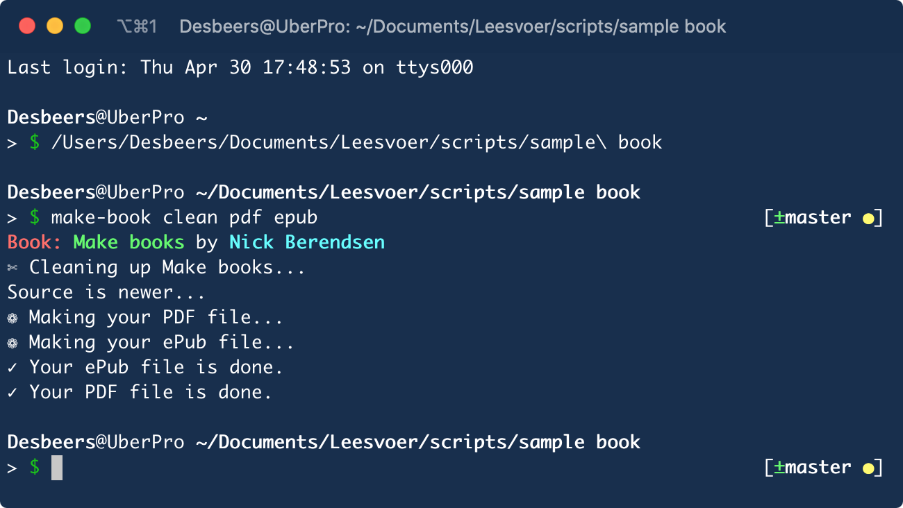

# Compiling your book

#image

Compiling the book will be done on the command line with the `make-book` command, followed by some optional arguments.

You have to be in the folder containing the book. A picture says  more than thousand words, so please have a look:

---

If you run `make-book` without any argument it will give you a PDF and an ePub in the export folder. The optional arguments for the `make-book` command are the following:

## Clean the export folder: **clean**

This is a special command. It’s doesn’t create anything. Even the opposite; it will *clean* whatever book might have been compiled in the past and is still in the export folder. Don’t worry; it will not get even close to your writing stuff!
Please note; the script, or more precisely, the Make program, is smart. It will know when you have changed something in your book and will always grap *the latest and greatest* files. So, there is no need to *clean* for that reason.

## Output formats: **pdf**, **print**, **epub**, **eproof**

Just put any type you want to compile as argument. You can add as many as you like at the same time and order does not matter.

---

A few notes about the export formats:

### **pdf** & **print**

> They are basically the same. The only difference is that `pdf` will have the (optional) cover included and has a slightly coloured background while `print` will never have a cover and is just plain white. That makes the `print` file more suitable for uploading to a POD service for example. Also, `print` does not have coloured hyperlinks; even thought the links are still working.

### **epub** & **eproof**

> An `epub` is, you might have guessed it, an ePub! An `eproof` however, is an *ePub-ish* thing that is handy for Apples Books application. It is not really an ePub, but a folder with an epub extension you can add to Books for proof reading. See the [Apple website](https://help.apple.com/itc/booksassetguide/#/itc073460726) for more info.

## “secret” output formats: **html**, **docx**, **md**, **tex**

Not very well supported, but the script can produce some more formats. Use at your own risk. It will not set your computer on fire but the result might not be great...

### **html**

> This will give you a *standalone* html file. That means, it is just one file with everything included. Stylesheets, images, everything. I don’t see any use in this so that’s why it is at the moment still a pretty bare-bones output.

### **docx** (Word document)

> It works more or less; that’s all I can say about it. It is not a format I care about so I didn’t put too much effort in it. The *drop caps* are not working for example.

### **md** (Markdown)

> This output just glues your files into one Markdown file. It does not create a table of content or other fancy stuff. It will however remove hashtags if they are in the source files. I use iAwriter as writing software and that application put hashtags directly in the Markdown files. Very handy, but not while processing the files.

### **tex** (LaTeX format)

> It will be the complete `tex` file but I’m pretty sure you will not be able to compile it with any other software. The file will be stuffed with dependancies on this build-system and your images will be completely forgotten...

