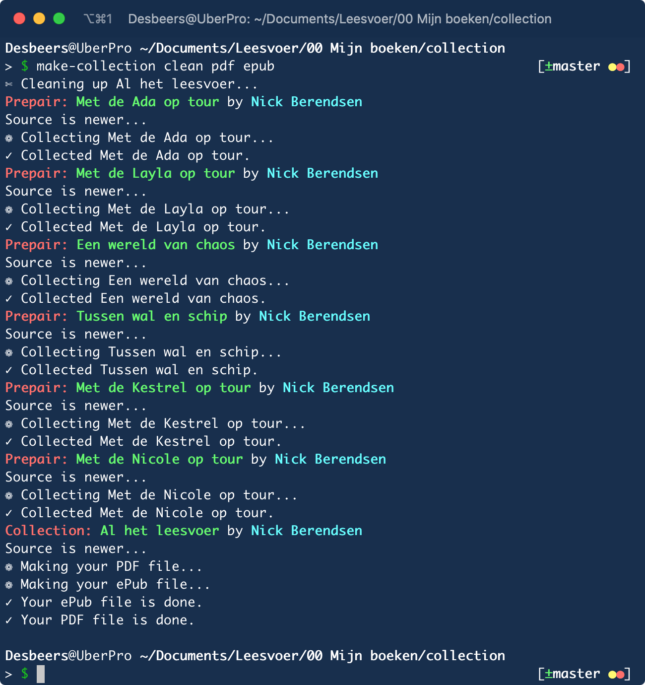

# Compiling book collections

Another script in the `/terminal` folder is `make-collection`. It’s ment to make a book, containing any of your other books. A big, fat, huge masterpiece of writing!

---

It might be a bit of a struggle for your computer because collecting more than thousand pages, as I have tried, is not an easy job... and for sure not a quick job... But doable.

Unlike the *normal* books, this kind of book needs a slightly different `make-book.md`. So different actually, that it is called `make-collection.md`. All the other files in the folder are just the same.

---

This file is where the collections related tags, as described in the *metadata chapter*, are essential. It still needs the other tags as well, of course. Name, title, etcetera.

## Give your collection a name

	---
	belongs-to-collection: My Huge Collection
	---
	
## Add books to this collection

To get a *normal* book into this collection; give it *exactly* the same `belongs-to-collection` tag, together with a number in its `make-book.md` file
	
	---
	belongs-to-collection: My Huge Collection
	group-position: 1
	---
	
Thats all. Make sure you are in the folder of your collection and enter the following command in the terminal:

	make-collection pdf epub
	
The arguments are again just like when you are making a normal book. You can make a collection in any kind of format that you can make your normal books.

## Additional files

If you like, you can add additional front- and backmatter pages to your collection. They are just like they are in a normal book, also in the same place. Keep the naming of the files in mind. Your `compilation` book will be collected in a temporarily folder, together with the selected books. The name of the book in the temporarily folder will start with the number from the `group-position` tag. . So, most probably starting with 1. As long as you start the name of your `front matters` with a 0; you are safe. And name your backmatter “99-name”, unless you have more than 99 books of course...

### Backmatter

You can add a `backmatter`; however, the header must be named a bit different than normal. This is because the build-system has no clue about the difference between a “collected backmatter” and a “collection backmatter. So, define the header as follows:

	# My collection backmatter page {.backcollection}

## Make all collections

Just as with the `make-all-books` we also have a `make-all-collections` in the `/terminal` folder. It behaves exactly the same as well.

{width=50%}

