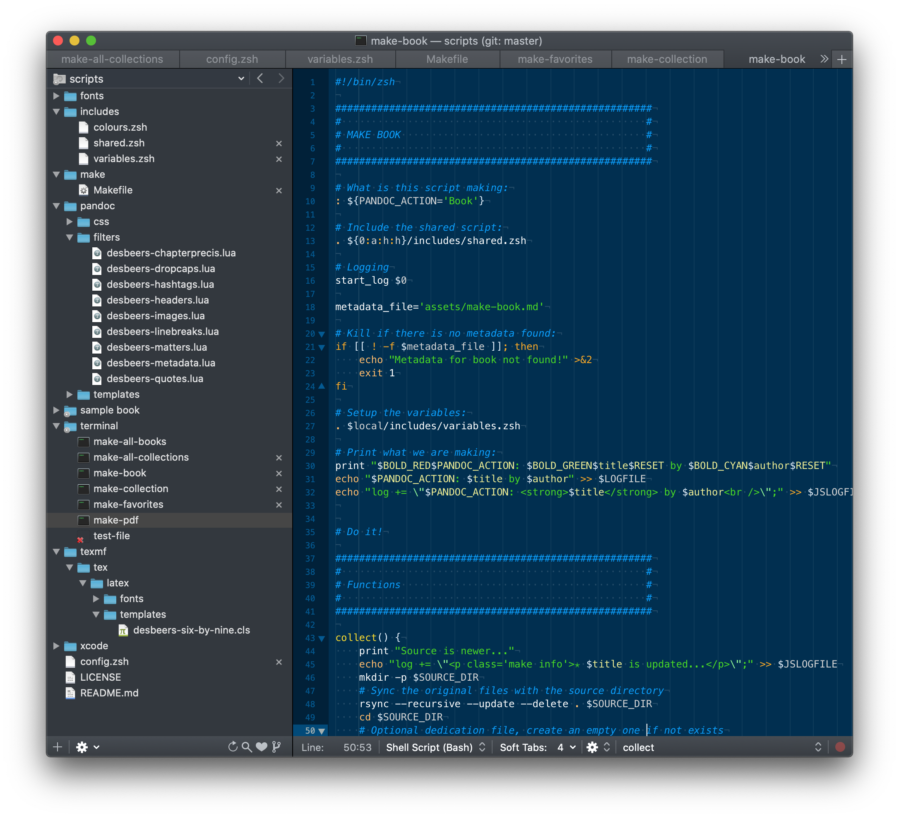

# What are all those files?

#image

Let’s get trough the piles of folders and files inside the `make-book` folder and give it some explanation....

I will not go trough them one by one; that’s too boring and also not so interesting. No, instead I take you on a tour. Let say we are in the folder containing this book and type `make-book clean pdf epub`.

## File: /terminal/make-book

`make-book` is a shell script in the `/terminal` folder. It will check if you are in a *correct book folder*. If not, it will punish you and stop.

If it is all ok; it will grab your `config.zsh` in the root folder so it knows where to drop your fresh book in the end. That’s why you need to set an `export folder`.

Then it will set-up a whole bunch of necessary  *variables* by including `/includes/variables.zsh` . This file is shared by all the other scripts as well to save me from typing over and over again.

Then, the time has come... We are ready for Make. Make is a verb, oh yeh, because it is an application you have installed if you followed the install instructions nicely. Make is a program to make stuff; in our case, a book. Let’s make it by running make!

## File: /make/Makefile

The `Makefile` is the heart of the build-system; all the smart stuff is happening over there. Make needs that file because it will set a lot of settings, grabs your writing stuff and gives that as homework to Pandoc to do what Pandoc can do best. Convert your Markdown to PDF and an ePub in this case...

To give Pandoc proper homework, the Makefile includes a whole bunch of other files...

## Folder: /pandoc/templates

This is where the templates are stored for Pandoc. It should know how we like the layout to be, of course! Pandoc has a lot of *default* templates but I like my own better. There are templates for PDF and ePub in here, as well sub-templates to get the `dedication` page for example.

## Folder: /pandoc/filters

To customise Pandoc’s output you can run the content trough filters. And believe me, the content will run really hard! A lot of smart-ass stuff is happening in there, so it even deserves its own page in this book... 

## Folder: /pandoc/css

Here you can find the stylesheets for the ePub and html output. I did not put much effort in the html styling yet...

## Folder: /texmf/tex/latex

Pandoc is doing great, but lets not give it *all* the credit. It does get some help to make that PDF. PDF’s are actually made by `LuaLaTeX`. Also a story by itself that will come later on. All I will say now that the LaTeX templates and some font info are stored here. Ok, and I will also tell you now that this script-stuff is temporarily disabling your local tex folder if you happen to have one... So you know...

## Folder: /xcode

Last but not least... The Xcode folder... Feel free to have a look in it. It’s the source code for a Mac application that can run a bunch of the scrips here.
It does work for me, somehow, however, I have no clue what I did to make it work so *it is as it is*. Don’t dare to ask me any questions about it; because the answer is: **I don’t know**, haha!

## Bonus file: /terminal/make-file

This script converts a Markdown document into a single PDF. Use it on the command line again:

	make-file my-text.md

The PDF will be dropped on your Desktop. Be careful; if there is already a file over there with the same name it will be overwritten! Thats why this is only a bonus file; it’s not too smart...

