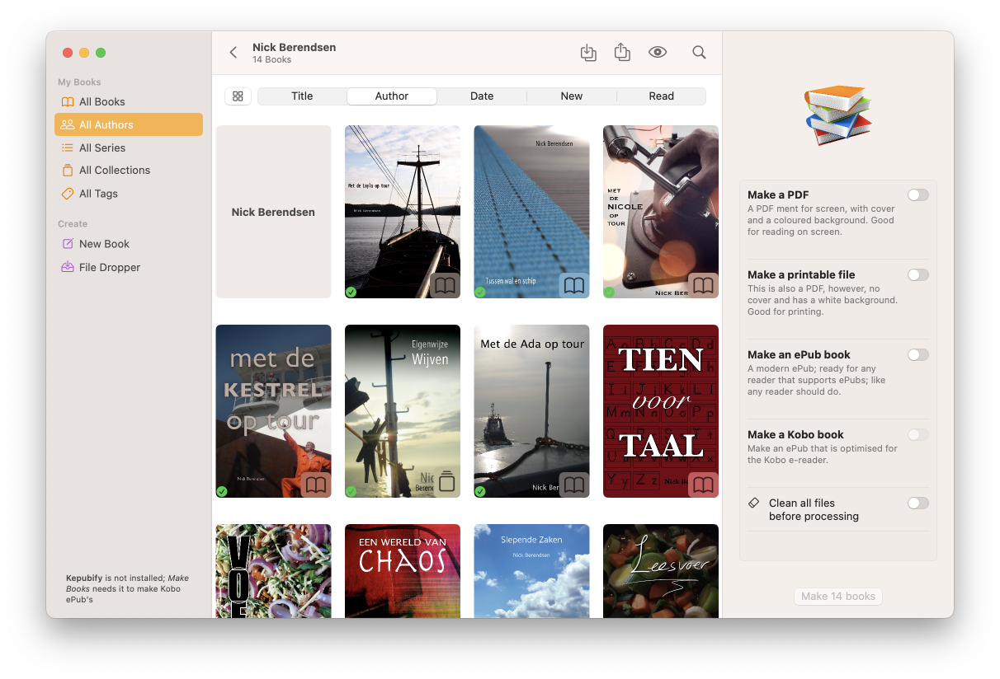

# A real macOS application

Remember that folder named `/xcode` that I don’t really want to talk about? It is not the Automator Application and Workflow that I was talking about. No no, this is the Real Deal. A real macOS application written in the `swift` language. For now, I don’t recommend to use it, it might eat your hard drive for breakfast because it doesn’t care about Mister Gatekeeper. But it looks pretty, that’s for sure! So, at you own risk!

